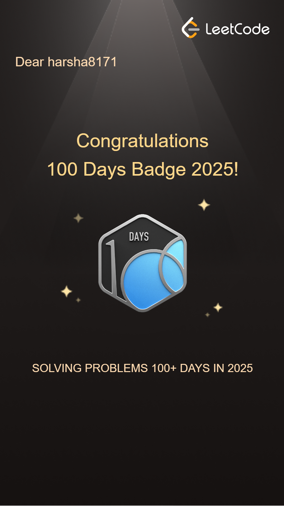
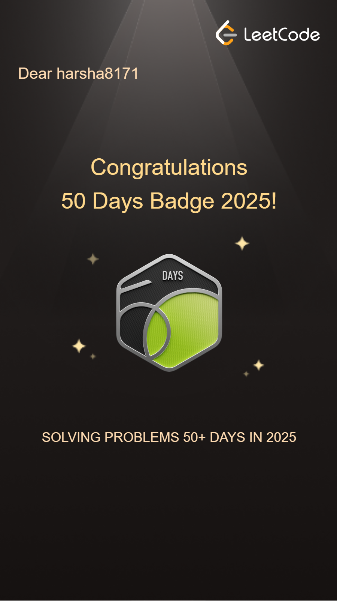
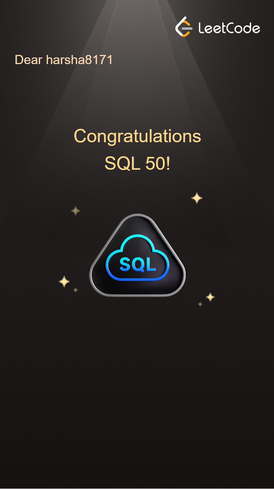

<h1 align="center">Hi 👋, I'm Sri Harsha Bommineni</h1>

<h3 align="center">I am a final-year B.Tech Computer Science (AI & ML) student passionate about Artificial Intelligence, Machine Learning, and Software Development. I enjoy building real-world projects using Python, C++, SQL, and Generative AI while solving real-world problems through technology.</h3>

## 🚀 About Me
🚀 About Me
🎓 Final-year B.Tech in Computer Science (AI & ML)
🌱 Currently learning Data Structures & Algorithms, System Design, MERN Stack, and Generative AI
💻 Building projects with Python, C++, Machine Learning, RAG, Streamlit, Flask, and the MERN Stack
🤖 Interested in Software Engineering, Artificial Intelligence, Machine Learning, and Backend Development
💬 Ask me about Python, C++, DSA, Machine Learning, RAG Applications, and Full-Stack Development
📫 Email: sriharsha8171@gmail.com
🌟 Always exploring new technologies and building projects that solve real-world problems.

---

## 📚 Education

- **B.Tech CSE-AIML**, **Malla Reddy College Of Engineering And Technology** (2023 - 2027) 

---

## 💻 Tech Stack

---
## 🏆 Coding Profiles

  

  

## 🏅 LeetCode Badges

  
  
  
  
  

## 🔭 Projects & Highlights
- 👨‍💻[sms_spam-detection](https://github.com/sriharsha1817/sms_spam-detection) — A machine learning model that detects spam messages using Scikit-learn, Streamlit, and extensive EDA and preprocessing.
- 👨‍💻 [Banking System](https://github.com/sriharsha1817/Banking-System.git) — A C++-based CLI application for managing bank accounts with file handling and exception support.
- 👨‍💻 [Blood Bank Management System](https://github.com/sriharsha1817/Blood-Bank-Management-System-Enhancing-Blood-Donation-Accessibility.git) — A role-based Flask web app for managing blood donations, real-time requests, and stock using SSE, MySQL, and Flask-Login.
- 👨‍💻[GestureSnake: Hand-Controlled Adventure](https://github.com/sriharsha1817/GestureSnake-Hand-Controlled-Adventure.git) —  A Python-based OpenCV game where the snake is controlled using real-time hand gestures via MediaPipe with dynamic speed and intuitive palm tracking.
- 👨‍💻[RAG-GPT](https://github.com/sriharsha1817/Gemini-Powered-Custom-Document-Q-A-Assistant-RAG-GPT-.git) —  A Streamlit-based RAG chatbot that lets users upload PDF, DOCX, or TXT files and ask questions, retrieving relevant chunks using TF-IDF and generating contextual answers via Google's Gemini API with source tracking and chat history.
- 👨‍💻[Stock-Price-Dashboard](https://github.com/sriharsha1817/Stock-Price-Dashboard.git) —  A comprehensive financial analysis platform combining real-time stock data visualization with an AI-powered chatbot for intelligent market insights.
- 👨‍💻[Hyperlocal-Store-Wise-Search-Insights-Dashboard](https://github.com/sriharsha1817/Hyperlocal-Store-Wise-Search-Insights-Dashboard.git) —  This project is a sophisticated "Hyperlocal Search Insights Dashboard" designed for a retail chain like KFC. It acts as an analytical tool for regional managers or business analysts to monitor and understand the search performance of different store locations.
---
---

## 🧠 Data Structures & Algorithms

I actively solve problems on **LeetCode** and **CodeChef** to sharpen my algorithmic skills.

---
## 📊 GitHub Stats

## 📫 Connect with me

   &nbsp;
   &nbsp;
   &nbsp;
   &nbsp;
  

## 📊 GitHub Stats

  

---

